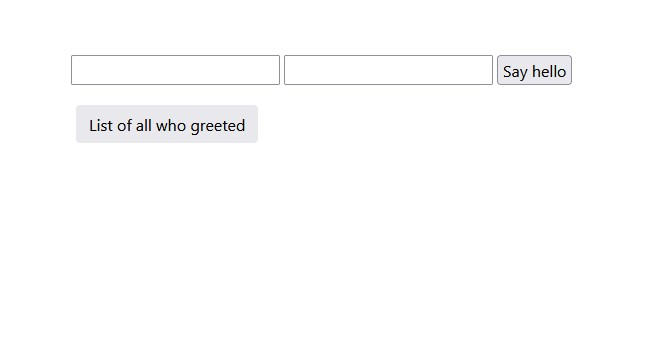
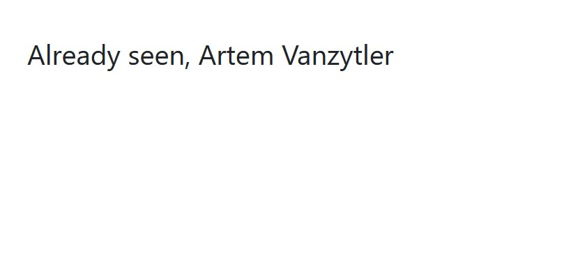
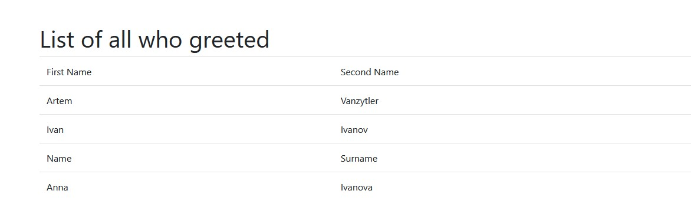

# Say Hello<br />
A web page that greets everyone who visits it. .<br />



# Download & Setup Instructions :
* Clone the project. This will download the GitHub respository files onto your local machine.</br>
```Shell
git clone https://github.com/teredet/SayHello
```
* Run program
```Shell
    python server.py
```

# Features
* The program receives a first and last name. 
* If this is a new person, then it outputs "Hello, Name Surname" and feeds the first and last name into the SQLite3 database. 
* If this person is already in the database, it displays "Already seen, Name Surname".
* There is also a button on the main page by clicking on which you go to a page with all users.

# Tech Stack
* Python
* CGI
* SQLite3
* HTML

# Images




